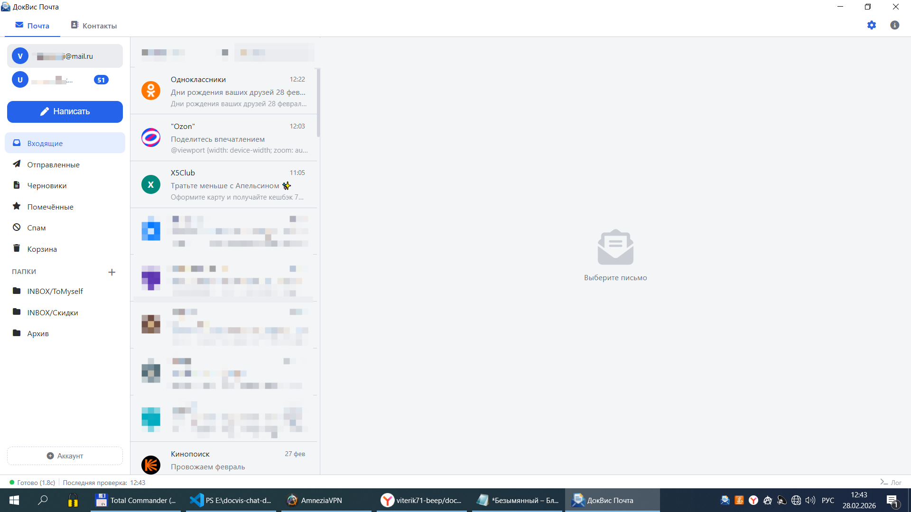
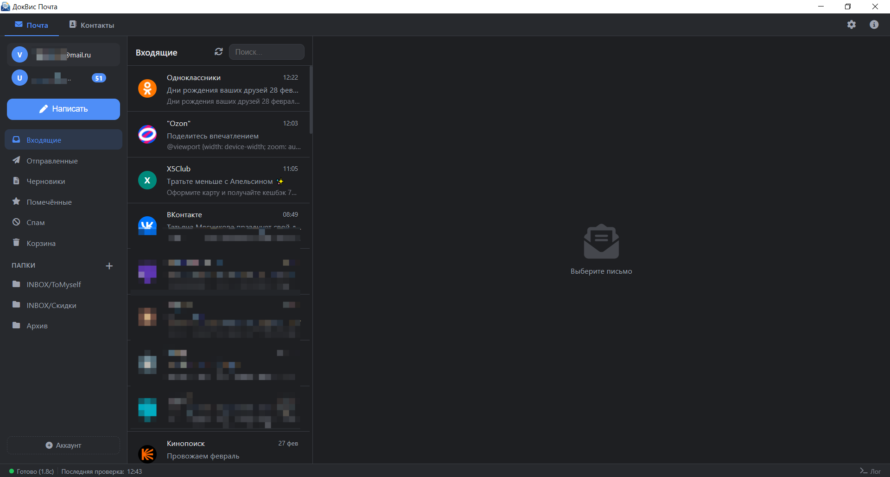

# ДокВис Почта


Десктопный почтовый клиент с открытым исходным кодом для Windows на базе [Tauri](https://tauri.app/) (Rust + WebView2).
Работает полностью офлайн — все зависимости встроены, интернет требуется только для работы с почтой.

> **Язык интерфейса:** Русский

---

## Скриншоты

| Светлая тема | Тёмная тема |
|---|---|
|  |  |

---

## Возможности

### Почта
- **Несколько аккаунтов** — добавление и переключение между почтовыми ящиками; у каждого аккаунта своя подпись
- **Поддерживаемые провайдеры**: Mail.ru, Яндекс.Почта, Gmail, любой IMAP/SMTP сервер
- **Получение писем по IMAP** с постраничной загрузкой (пагинация)
- **Автосинхронизация** с настраиваемым интервалом (выкл / 5 / 15 / 30 / 60 мин)
- **Отправка писем по SMTP** с поддержкой TLS
- **Вложения**: просмотр, сохранение, перетаскивание файлов в окно написания (Drag & Drop)
- **Автосохранение вложений** в указанную папку при получении новых писем — структура папок строится по дате письма (`Почта/год/месяц/день/чч-мм/`)
- **HTML-письма** с безопасным рендерингом (DOMPurify)

### Работа с письмами
- Прочитано / Непрочитано
- Помечено звёздочкой (избранное)
- Перемещение в корзину и спам
- Блокировка отправителя
- Массовые операции: удаление, пометка прочитанными
- Очистка корзины
- Перемещение писем между папками
- Уведомления о запросе подтверждения прочтения (read receipt)

### Папки
- Отображение всех IMAP-папок (Входящие, Отправленные, Черновики, Спам, Корзина, пользовательские)
- Создание, переименование и удаление пользовательских папок
- Перемещение писем в любую папку

### Контакты
- Список контактов с поиском
- Создание, редактирование, удаление контактов
- **Группы контактов** (категории)
- Быстрое добавление отправителя в контакты
- Импорт контактов из **vCard (.vcf)**
- Импорт контактов из **CSV**

### Уведомления
- Всплывающие десктопные уведомления о новых письмах
- Звуковое оповещение при получении новых писем

### Безопасность

**Конфиденциальность:**
- **Никакой рекламы** — приложение не содержит рекламных модулей, баннеров и трекеров
- **Нет аналитики** — данные об использовании не собираются и никуда не отправляются
- **Нет облака** — вся почта хранится локально на компьютере пользователя

**Хранение учётных данных:**
- Пароли хранятся в **системном хранилище ключей** Windows (Credential Manager) через `keyring` — не в файлах и не в базе данных
- Никакие учётные данные не передаются третьим сторонам
- Все соединения с почтовыми серверами только через **TLS/SSL**

**Безопасное чтение писем:**
- **Изолированный iframe** с атрибутом `sandbox` — HTML-письмо выполняется в полностью отдельном контексте, стили и скрипты письма не влияют на интерфейс приложения
- **Блокировка внешних изображений по умолчанию** — картинки в письмах заменяются прозрачным пикселем, загрузка только по явному разрешению пользователя (защита от трекеров)
- **Санитизация HTML через DOMPurify** — удаление потенциально опасных тегов и атрибутов перед отображением
- **Защита редактора ответа/пересылки** — цитата исходного письма санитизируется перед вставкой в редактор; внешние изображения в цитате скрыты по умолчанию с кнопкой «Показать»
- **Предупреждение при переходе по ссылкам** — перед открытием любой ссылки из письма показывается модальное окно с адресом назначения и предупреждением; дополнительно проверяются: незащищённое соединение (HTTP), IP-адрес вместо домена, сокращатели ссылок (bit.ly, vk.cc и др.), нестандартные символы в домене (homograph-атаки)
- **Блокировка отправителя** — возможность заблокировать нежелательных отправителей

**Проактивная защита от опасных вложений:**

> **Принцип работы отличается от антивирусов.** Антивирус ищет известные сигнатуры и пропускает новые угрозы (zero-day). Здесь применяется другой подход — **блокировка по типу файла**, независимо от содержимого: неизвестный вредонос в `.exe` нейтрализуется так же, как известный. Именно этот принцип используют корпоративные почтовые шлюзы уровня Microsoft Defender for Office 365 и Proofpoint.

- Опция **«Защита от опасных вложений»** в настройках (включена по умолчанию)
- При автосохранении опасные файлы автоматически переименовываются — расширение нейтрализуется (`invoice.exe` → `invoice.[virus]_exe`), файл невозможно случайно запустить, содержимое при этом сохраняется
- При клике на опасный тип файла выводится предупреждение с запросом подтверждения
- **Сканирование архивов** (ZIP, 7z, RAR) без распаковки: если внутри обнаружены опасные файлы — архив нейтрализуется; зашифрованные архивы (содержимое не проверяемо) также помечаются как потенциально опасные; RAR сканируется через UnRAR.exe (при наличии WinRAR)

<details>
<summary>Полный список нейтрализуемых расширений (55+)</summary>

| Категория | Расширения |
|---|---|
| Исполняемые | `.exe` `.msi` `.msp` `.mst` `.com` `.scr` `.pif` `.dll` `.cpl` `.ocx` `.msc` `.xbap` `.appref-ms` |
| PowerShell | `.ps1` `.ps2` `.psm1` `.psd1` `.ps1xml` `.ps2xml` `.psc1` `.psc2` |
| Скрипты Windows | `.vbs` `.vbe` `.vb` `.vbp` `.js` `.jse` `.wsf` `.wsh` `.ws` `.wsc` `.sct` `.shb` `.shs` |
| Скрипты общие | `.py` `.rb` `.pl` `.php` |
| Ссылки и веб | `.lnk` `.url` `.hta` `.website` `.mht` `.mhtml` |
| Реестр | `.reg` `.inf` |
| OneNote | `.one` `.onepkg` *(массовый вектор атак с 2023 г.)* |
| SVG | `.svg` *(может содержать JavaScript)* |
| Виртуальные диски | `.vhd` `.vhdx` *(обход Mark-of-the-Web)* |
| Windows-специфичные | `.chm` `.hlp` `.gadget` `.scf` `.diagcab` `.diagpkg` `.settingcontent-ms` `.theme` `.themepack` `.search-ms` `.searchconnector-ms` |
| Java | `.jnlp` `.class` |
| Access | `.ade` `.adp` `.mda` `.mdb` `.mde` `.mdt` `.mdw` `.mdz` |
| Office с макросами | `.docm` `.dotm` `.xlsm` `.xlsb` `.xltm` `.xlam` `.xll` `.pptm` `.potm` `.ppam` `.ppsm` `.sldm` `.pub` `.pubm` `.wll` |
| Опасные архивы | `.iso` `.img` `.cab` `.arj` `.ace` `.lzh` `.lha` `.lz` `.tar` `.uue` `.xz` `.z` `.zipx` `.bz2` `.gz` |

</details>

### Резервное копирование
- Ручное создание резервной копии базы данных
- Автоматическое резервное копирование с настраиваемым интервалом (в днях)
- Восстановление из резервной копии
- Открытие папки с резервными копиями из интерфейса

### Интерфейс
- Светлая и тёмная тема
- **Строка состояния** — отображает текущий статус синхронизации и количество загруженных писем
- **Журнал событий (лог)** — запись операций синхронизации, ошибок подключения и действий пользователя
- Системный трей с контекстным меню
- Автозапуск при старте Windows
- Только русский язык интерфейса
- Полностью офлайн — не требует подключения к CDN

---

## Системные требования

| Параметр | Минимум |
|---|---|
| ОС | Windows 10 (1803+) / Windows 11, x64 |
| WebView2 | Входит в поставку установщика (offline installer) |
| Оперативная память | 100 МБ |
| Дисковое пространство | 50 МБ |
| Сеть | IMAP (порт 993) и SMTP (порт 465 или 587) |

> **Примечание:** WebView2 Runtime устанавливается автоматически во время инсталляции, дополнительных действий не требуется.

> **Windows 7 / 8 / 8.1** — запуск теоретически возможен при наличии старой версии WebView2 Runtime, которая поддерживала эти системы. Однако Microsoft прекратила обновления WebView2 для данных ОС с января 2023 года. Устаревший WebView2 может содержать неисправленные уязвимости безопасности. **Используйте на свой страх и риск**, официальная поддержка не предоставляется.

---

## Установка

1. Скачайте файл `ДокВис Почта_1.0.0_x64-setup.exe` из раздела [Releases](../../releases)
2. Запустите установщик и следуйте инструкциям
3. При первом запуске добавьте почтовый аккаунт через кнопку **«Добавить аккаунт»**

---

## Настройка почтового аккаунта

| Провайдер | IMAP | SMTP |
|---|---|---|
| Mail.ru | `imap.mail.ru:993` | `smtp.mail.ru:465` |
| Яндекс | `imap.yandex.ru:993` | `smtp.yandex.ru:465` |
| Gmail | `imap.gmail.com:993` | `smtp.gmail.com:465` |
| Другой | указать вручную | указать вручную |

> Для Gmail и Яндекса может потребоваться создание **пароля приложения** в настройках аккаунта (если включена двухфакторная аутентификация).

---

## Технологии

| Компонент | Технология |
|---|---|
| Фреймворк | [Tauri 1.5](https://tauri.app/) |
| Бэкенд | Rust |
| База данных | SQLite (rusqlite) |
| IMAP | [imap](https://crates.io/crates/imap) |
| SMTP | [lettre](https://crates.io/crates/lettre) |
| Хранение паролей | [keyring](https://crates.io/crates/keyring) |
| Фронтенд | Vanilla JS, HTML, CSS |
| Иконки | Font Awesome 6.4.0 (офлайн) |

---

## Сборка из исходников

### Требования
- [Rust](https://rustup.rs/) (stable)
- [Node.js](https://nodejs.org/) 18+
- [Tauri CLI](https://tauri.app/v1/guides/getting-started/prerequisites/)

### Команды

```bash
# Установить зависимости
npm install

# Режим разработки
npm run dev

# Сборка установщика
npm run build
```

Готовый установщик появится в:
`src-tauri/target/release/bundle/nsis/ДокВис Почта_1.0.0_x64-setup.exe`

---

## Лицензия

MIT © 2026 ДокВис
